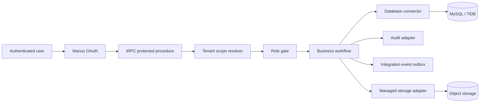

# Elegex Architecture

Elegex is a multi-tenant operations workspace built around a single invariant: **every protected business operation executes within an organization scope resolved from the authenticated user’s membership**. The frontend is React and TanStack Query; the server is Express with tRPC contracts; persistence is Drizzle over MySQL/TiDB; documents are stored through the managed object-storage adapter.

## Layers

| Layer | Location | Responsibility |
|---|---|---|
| API contract | `server/routers/` | Input validation, protected tRPC procedures, and role gates. |
| Workflow service | `server/db.ts` | Tenant-scoped business operations and lifecycle orchestration. |
| Database connector | `server/connectors/database.ts` | Shared client lifecycle, transaction boundary, and readiness check. |
| Audit connector | `server/connectors/audit.ts` | Immutable organization-scoped activity evidence. |
| Outbox connector | `server/connectors/outbox.ts` | Idempotent integration connection and event-queue persistence. |
| Storage adapter | `server/storage.ts` | File validation, key construction, upload, and signed retrieval. |
| Data model | `drizzle/schema.ts` | Tenant-bearing tables, indexes, enums, and migrations. |

## Multi-tenant boundaries

`organizationId` is part of every business query, mutation, audit event, document, saved view, connector configuration, and outbox event. The client never chooses its own organization ID. `tenantProcedure` derives the scope server-side, and role checks run before a protected action reaches its persistence adapter.

## Transactional workflows

`withTransaction` is used where a workflow spans multiple durable writes. Task creation, for example, atomically creates the task, assignment notification, and audit entry. A failure in any step rolls back the entire unit of work rather than leaving partial state.

## Connector outbox

Integration connections persist only non-secret configuration and a `secretReference`. Delivery work is written to `integrationEvents` with an idempotency key. A future dispatcher can claim pending events, retry failures, and safely avoid duplicate external effects without putting third-party credentials or queues inside a request handler.
