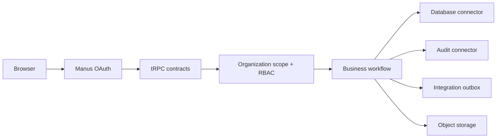

# Elegex Operations Workspace

> A production-minded, multi-tenant operations workspace that demonstrates how polished product UX, strict tenant isolation, and practical integration architecture can live in the same codebase.

    

Elegex is a full-stack **global job-management and field-service operations platform**. It brings office booking, dispatch, field evidence, quote status, external invoice links, documents, reporting, and workspace administration into one tenant-scoped workspace. It is designed as an engineering showcase: every protected operation is role-gated and backed by a typed API contract.

## Why this repository stands out

| Capability | Implementation |
|---|---|
| Multi-tenancy | The server derives the workspace from authenticated membership; business queries never accept a client-owned organization ID. |
| Five-role RBAC | Owner, admin, manager, member, and viewer permissions are enforced in protected tRPC procedures and covered by authorization tests. |
| Transaction integrity | Cross-table workflows use a dedicated `withTransaction` boundary to avoid partial task, notification, and audit writes. |
| Connector architecture | Shared database, audit, storage, and idempotent integration-outbox adapters isolate infrastructure from feature contracts. |
| Operational resilience | Integration connections use secret references rather than database credentials; the durable outbox supports future retry-safe delivery. |
| Developer experience | TypeScript, Drizzle migrations, Vitest tests, a complete seed, CI quality gates, PR template, security policy, and repository docs. |

## Product surface

The application includes a Recharts office command centre, controlled job stages, dispatch visits, geo-status signals, job materials, field evidence metadata, quote and invoice-link records, six-month commercial reporting with CSV export, contacts/programmes/exceptions/tasks, scoped document uploads, notifications, saved views, detail pages, and protected administration. Staging readiness is available as a privileged, evidence-led control surface.

## Architecture at a glance



Read the detailed [architecture guide](ARCHITECTURE.md), [connector design](docs/database-connectors.md), [protected contract map](docs/api-contracts.md), [procedure catalogue](docs/procedure-catalogue.md), [entity relationship guide](docs/entity-relationship.md), [migration and reseed runbook](docs/migration-runbook.md), [production operations guide](docs/production-operations.md), [production failure classification](docs/audit/production-failure-classification.md), [database integrity audit](docs/database-integrity-audit.md), [synthetic demo coverage](docs/audit/demo-data-coverage.md), and [reference UX analysis](docs/audit/reference-ux-analysis.md).

## Quick start

```bash
pnpm install
pnpm dev
```

The managed deployment injects its environment configuration automatically. For an external clone, copy the variable names from [`config/environment.template`](config/environment.template), then configure the [documented variables](docs/environment.md) through your hosting provider’s encrypted secret manager; do not commit an `.env` file.

## Database lifecycle

The schema is defined in `drizzle/schema.ts`. For any change, generate a migration, inspect the SQL, then apply it in the target environment.

```bash
pnpm db:generate
pnpm db:migrate
```

Seed a standalone demo workspace with a deterministic **six-month synthetic field-service history**:

```bash
SEED_OPEN_ID=local-demo-owner pnpm seed:demo
```

The seed includes 36 jobs, 36 dispatch visits, 72 materials, 72 evidence items, 12 quotes, linked synthetic invoices, six monthly operating snapshots, release evidence, and named synthetic documents. In the managed demo, the first successful OAuth sign-in creates an isolated owner workspace automatically. The owner can restore original demo data from **Administration → Reset demo data**.

## Staging and release controls

The application includes a privileged **Staging readiness** page showing environment releases, rollback references, and verification evidence. The data in that page is synthetic demonstration evidence; the repository controls that underpin it are real code, migrations, tests, and CI configuration. Read the [staging runbook](docs/staging-runbook.md), [demo-data catalogue](docs/demo-data-catalog.md), and [A–Z release audit matrix](docs/audit/a-to-z-acceptance-matrix.md) before deploying externally.

## Quality checks

```bash
pnpm check        # TypeScript
pnpm test         # Authorization and contract tests
pnpm build        # Production bundle
pnpm verify       # All three checks
```

GitHub Actions runs the same verification suite on pull requests and pushes to `main`.

## Repository map

| Path | Purpose |
|---|---|
| `client/` | React 19 user interface, Recharts dashboard, and typed tRPC hooks. |
| `server/routers/` | Zod-validated protected tRPC contract surface. |
| `server/connectors/` | Database lifecycle, transaction, audit, and integration-outbox adapters. |
| `server/storage.ts` | Managed object-storage adapter for scoped documents. |
| `drizzle/` | Drizzle schema, migration history, and snapshots. |
| `scripts/seed-demo.mjs` | Repeatable realistic demo workspace seed. |
| `docs/` | Architecture, connector, API-contract, staging, demo-data, and audit documentation. |
| `.github/` | Pull-request template and CI quality workflow. |

## Security principles

> Tenant isolation belongs on the server, never in a client-side filter.

Every protected procedure resolves the requester’s membership before it queries or mutates data. Viewers are read-only; managers cannot access workspace administration; owners and administrators govern members, settings, reset operations, and integration connectors. Documents are stored outside the relational database, while connector secrets are referenced—not persisted—by application metadata.

Review [SECURITY.md](SECURITY.md) for vulnerability reporting and handling guidance, and [CONTRIBUTING.md](CONTRIBUTING.md) for the collaboration workflow.

## Demonstration-data boundary

> All seeded clients, staff names, job histories, commercial values, field evidence, documents, invoice references, and release records are **synthetic demonstration data**. They exist to exercise the product surface and must not be presented as real operating performance or customer records.
