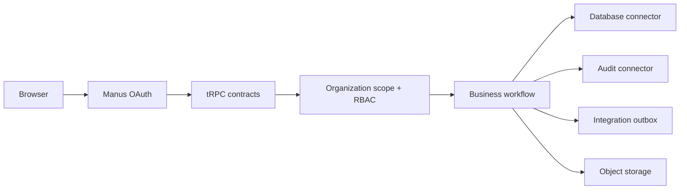

# Elegex Operations Workspace

> A production-minded, multi-tenant operations workspace that demonstrates how polished product UX, strict tenant isolation, and practical integration architecture can live in the same codebase.

    

Elegex is a full-stack business management platform for contacts, projects, cases, tasks, documents, notifications, reporting, and workspace administration. It was designed as an engineering showcase: every protected operation is tenant-scoped, role-gated, and backed by a typed API contract.

## Why this repository stands out

| Capability | Implementation |
|---|---|
| Multi-tenancy | The server derives the workspace from authenticated membership; business queries never accept a client-owned organization ID. |
| Five-role RBAC | Owner, admin, manager, member, and viewer permissions are enforced in protected tRPC procedures and covered by authorization tests. |
| Transaction integrity | Cross-table workflows use a dedicated `withTransaction` boundary to avoid partial task, notification, and audit writes. |
| Connector architecture | Shared database, audit, storage, and idempotent integration-outbox adapters isolate infrastructure from feature contracts. |
| Operational resilience | Integration connections use secret references rather than database credentials; the durable outbox supports future retry-safe delivery. |
| Developer experience | TypeScript, Drizzle migrations, Vitest tests, a complete seed, CI quality gates, PR template, security policy, and repository docs. |

## Product surface

The application includes a live Recharts dashboard, record lifecycles for contacts/projects/cases, project-linked tasks with assignments and due dates, scoped file uploads, notifications, filterable/exportable reports, saved views, dedicated detail pages, and protected administration.

## Architecture at a glance



Read the detailed [architecture guide](ARCHITECTURE.md), [connector design](docs/database-connectors.md), and [protected contract map](docs/api-contracts.md).

## Quick start

```bash
pnpm install
pnpm dev
```

The managed deployment injects its environment configuration automatically. For an external clone, copy the variable names from [`config/environment.template`](config/environment.template), then configure the [documented variables](docs/environment.md) through your hosting provider’s encrypted secret manager; do not commit an `.env` file.

## Database lifecycle

The schema is defined in `drizzle/schema.ts`. For any change, generate a migration, inspect the SQL, then apply it in the target environment.

```bash
pnpm db:generate
pnpm db:migrate
```

Seed a standalone demo workspace with realistic operational data:

```bash
SEED_OPEN_ID=local-demo-owner pnpm seed:demo
```

In the managed demo, the first successful OAuth sign-in creates an isolated owner workspace and rich seed data automatically. The owner can restore original demo data from **Administration → Reset demo data**.

## Quality checks

```bash
pnpm check        # TypeScript
pnpm test         # Authorization and contract tests
pnpm build        # Production bundle
pnpm verify       # All three checks
```

GitHub Actions runs the same verification suite on pull requests and pushes to `main`.

## Repository map

| Path | Purpose |
|---|---|
| `client/` | React 19 user interface, Recharts dashboard, and typed tRPC hooks. |
| `server/routers/` | Zod-validated protected tRPC contract surface. |
| `server/connectors/` | Database lifecycle, transaction, audit, and integration-outbox adapters. |
| `server/storage.ts` | Managed object-storage adapter for scoped documents. |
| `drizzle/` | Drizzle schema, migration history, and snapshots. |
| `scripts/seed-demo.mjs` | Repeatable realistic demo workspace seed. |
| `docs/` | Architecture, database connector, and API-contract documentation. |
| `.github/` | Pull-request template and CI quality workflow. |

## Security principles

> Tenant isolation belongs on the server, never in a client-side filter.

Every protected procedure resolves the requester’s membership before it queries or mutates data. Viewers are read-only; managers cannot access workspace administration; owners and administrators govern members, settings, reset operations, and integration connectors. Documents are stored outside the relational database, while connector secrets are referenced—not persisted—by application metadata.

Review [SECURITY.md](SECURITY.md) for vulnerability reporting and handling guidance, and [CONTRIBUTING.md](CONTRIBUTING.md) for the collaboration workflow.
