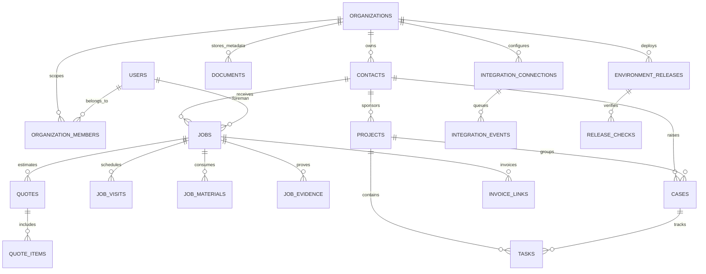

# Elegex Entity Relationship Guide

> **Tenant boundary:** every operational row is owned by `organizationId`. The server derives that value from the authenticated membership; a caller never supplies it as an API parameter.

## Integrity strategy

The schema deliberately uses **application-enforced tenant relationships** rather than database foreign keys. This preserves safe isolated reset/reseed behavior on the managed TiDB/MySQL environment while avoiding cascades that could span a tenant boundary. Every relationship-bearing mutation uses a tenant predicate before writing. Tenant-local natural keys are protected by unique indexes, including project codes, case references, job numbers, quote numbers, document storage keys, connector names, invoice references, monthly snapshots, and outbox idempotency keys.

| Operational area    | Main history records                                     | Controlled state boundary                                     |
| ------------------- | -------------------------------------------------------- | ------------------------------------------------------------- |
| Office records      | Contacts, projects, cases, tasks, documents              | Role-gated CRUD with logical archival                         |
| Field execution     | Jobs, visits, materials, evidence, quotes, invoice links | Assignment-scoped foreman actions; controlled job-stage graph |
| Delivery operations | Releases, release checks, snapshots                      | Admin-only readiness and immutable release evidence           |
| Integrations        | Connections, outbox events, audit records                | Tenant-owned connections and connection-scoped idempotency    |

For the detailed live constraint and reset evidence, see [Database Integrity Audit](database-integrity-audit.md).
